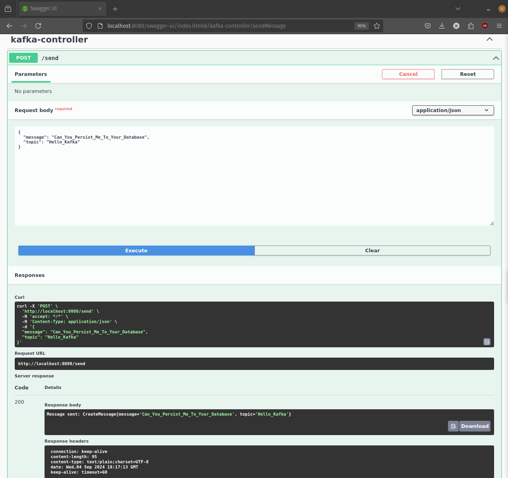
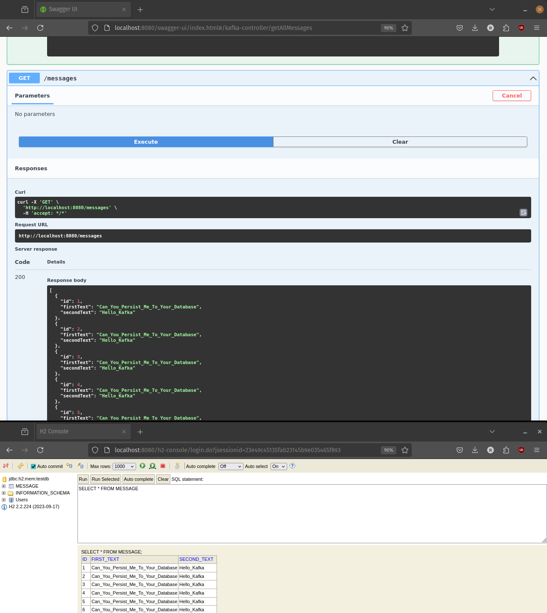

## This is a continuation of the first part of the tutorial and assumes that you have already completed the first part.

### Lets get dirty with some code straight away:
**We will be using the following tools:**
- **Docker**: To run Kafka cluster in a containerized environment.
- **Spring Boot**: To create a simple producer and consumer application.
- **IntelliJ IDEA**: As our IDE and REST client to test the application.
- **H2 Database**: To persist the messages.
- **Spring Data JPA**: To interact with the database.

**Setting up the Kafka Cluster:**
- Same as the first part.

**Creating the application using Spring Initializr:**
- Same as the first part plus:
- Add the following dependencies:
  - Spring Data JPA
  - H2 Database

**Creating the Producer Configuration:**
- Same as the first part.
    ```java
    public class KafkaProducerConfig {
    @Bean
    public ProducerFactory<String, CreateMessage> producerFactory() {
        Map<String, Object> configProps = new HashMap<>();
        configProps.put(ProducerConfig.BOOTSTRAP_SERVERS_CONFIG, "localhost:9092");
        configProps.put(ProducerConfig.KEY_SERIALIZER_CLASS_CONFIG, StringSerializer.class);
        configProps.put(ProducerConfig.VALUE_SERIALIZER_CLASS_CONFIG, JsonSerializer.class);
        return new DefaultKafkaProducerFactory<>(configProps);
    }
    @Bean
    public KafkaTemplate<String, CreateMessage> kafkaTemplate() {
        return new KafkaTemplate<>(producerFactory());
    }
    }
    ```
- As you can see instead of sending a simple string message we are sending a `CreateMessage` object.
- Also, we are using `JsonSerializer` to serialize the `CreateMessage` object.

**Creating the Producer:**
- Same as the first part.
    ```java
    public class MessageProducer {
    private KafkaTemplate<String, CreateMessage> kafkaTemplate;

    public MessageProducer(KafkaTemplate<String, CreateMessage> kafkaTemplate) {
        this.kafkaTemplate = kafkaTemplate;
    }

    public void sendMessage(String topic, CreateMessage message) {
        kafkaTemplate.send(topic, message);
    }
    }
    ```
- As you can see we are now sending a `CreateMessage` object (it's a data transfer object) instead of a simple string message.

**Creating the Consumer Configuration:**
- Create a new class named `KafkaConsumerConfig` and add the following code:
    ```java
    @Configuration
    public class KafkaConsumerConfig {
    @Bean
    public ConsumerFactory<String, CreateMessage> consumerFactory() {
    Map<String, Object> configProps = new HashMap<>();
    configProps.put(ConsumerConfig.BOOTSTRAP_SERVERS_CONFIG, "localhost:9092");
    configProps.put(ConsumerConfig.GROUP_ID_CONFIG, "my-group-id");
    configProps.put(ConsumerConfig.KEY_DESERIALIZER_CLASS_CONFIG, StringDeserializer.class);
    configProps.put(ConsumerConfig.VALUE_DESERIALIZER_CLASS_CONFIG, JsonDeserializer.class);
    configProps.put(JsonDeserializer.TRUSTED_PACKAGES, "com.rueloparente.kafka_hello_world_persistence.dto");
    return new DefaultKafkaConsumerFactory<>(configProps);
    }

    @Bean
    public ConcurrentKafkaListenerContainerFactory<String, CreateMessage> kafkaListenerContainerFactory() {
        ConcurrentKafkaListenerContainerFactory<String, CreateMessage> factory = new ConcurrentKafkaListenerContainerFactory<>();
        factory.setConsumerFactory(consumerFactory());
        return factory;
    }
    }
    ```
- As you can see we are now deserializing the message to a `CreateMessage` object.
- We are also setting the `TRUSTED_PACKAGES` property to the package where the `CreateMessage` object is located. This is important as otherwise, the deserialization will fail.

**Creating the Consumer:**
- Create a new class named `MessageConsumer` and add the following code:
    ```java
    @Component
    public class MessageConsumer {
    private MessageSpringRepository messageSpringRepository;

    public MessageConsumer(MessageSpringRepository messageSpringRepository) {
        this.messageSpringRepository = messageSpringRepository;
    }

    @KafkaListener(topics = "my-topic", groupId = "my-group-id")
    public void listen(CreateMessage message) {
        Message messageEntity = new Message(message.getMessage(), message.getTopic());
        messageSpringRepository.save(messageEntity);
    }

    public List<Message> getAllMessages() {
        return messageSpringRepository.findAll();
    }


    }
    ```
- As you can see we are now receiving a `CreateMessage` object instead of a simple string message.
- We are creating a `Message` entity from the `CreateMessage` object and saving it to the database.
- We are also adding a method to get all the messages from the database. Just for testing purposes.

### Let's see it in action:
- You should already know how to run the Kafka cluster.

- You should already know how to run the Spring Boot application.

- We will be using Swagger to test the application. But you can use any REST client or the rest demo provided.


- Now let's see if the listener did its job.


- And it seems to work well more than once.




