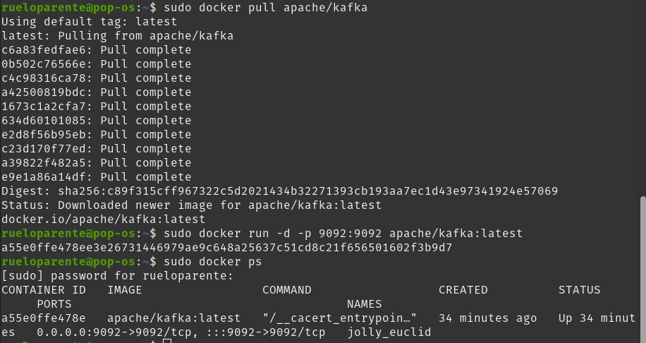
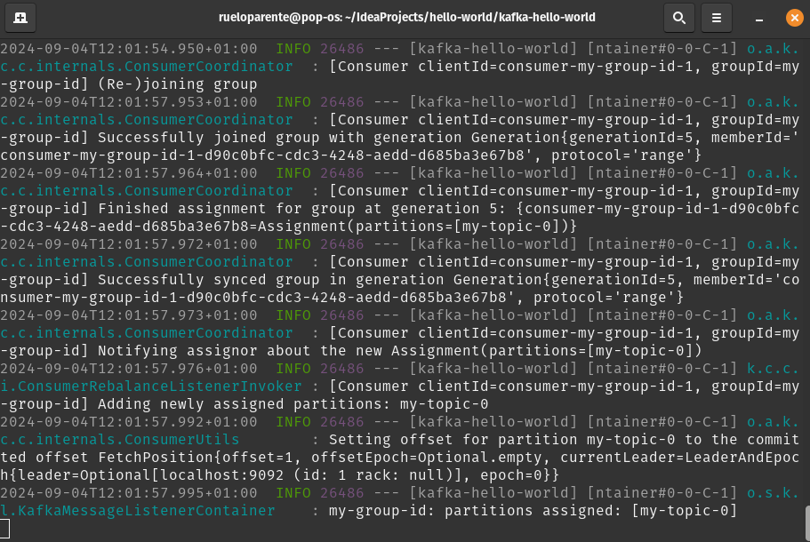
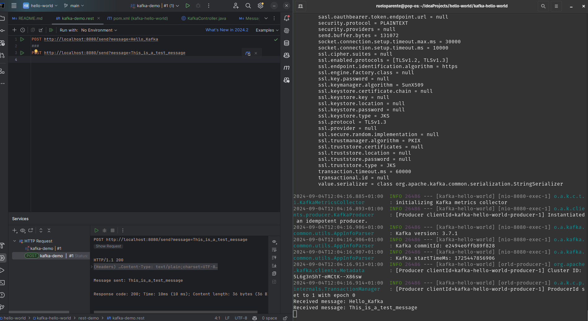

##### Enables that different parts of our application communicate in a seamless way. It allow for real-time communication. It's capable of handling massive amounts of data, making a perfect fit for high throughput applications that need real-time data streaming.

### Main features:
 **[Real Time Data Processing](./docs/RealTimeDataProcessing.md)**: Kafka excels at handling real-time data streams, making it ideal for applications requiring instant data updates and event-driven processing.

**[Scalability](./docs/Scalability.md)**: Its distributed nature enables seamless scalability, allowing you to handle large volumes of data without sacrificing performance.

 **[Fault Tolerance](./docs/FaultTolerance.md):** Kafka’s replication mechanism ensures that data is not lost even in the event of broker failures.    `

### Key Concepts:

**[Topics](./docs/Topics.md)**: Kafka organizes data into topics, which are essentially categories or channels in which records are published.

**[Producers](./docs/Producers.md)**: Producers are responsible for pushing data to Kafka topics. They can be considered data stream sources.

**[Consumers](./docs/Consumers.md)**: Consumers subscribe to topics and process the records pushed by producers. They are the recipients of the data streams.

**[Brokers](./docs/Brokers.md)**: Kafka clusters consist of brokers that store data and manage the distribution of records across topics.

**[Partitions](./docs/Partitions.md)**: Each topic can be divided into partitions, which allow for parallel processing and the distribution of data across the cluster.

### Lets get dirty with some code:
**We will be using the following tools:**
- **Docker**: To run Kafka cluster in a containerized environment.
- **Spring Boot**: To create a simple producer and consumer application.
- **IntelliJ IDEA**: As our IDE and REST client to test the application.


**Setting up the Kafka Cluster:**
-   Will be using the `apache/kafla` image to run the Kafka cluster.
-   To pull the image, run the following command:
    ```bash
    sudo docker pull apache/kafka
    ```
-   To run the Kafka cluster, execute the following command:
    ```bash
    sudo docker run -d -p 9092:9092 apache/kafka:latest
    ```
We now have a Kafka cluster running and we are mapping the port 9092 of the container to the port 9092 of the host machine.

**Creating the application using Spring Initializr:**
-   Go to [Spring Initializr](https://start.spring.io/).
-   Add the following dependencies:
    -   Spring Web
    -   Spring for Apache Kafka

**Creating the Producer Configuration:**
-   Create a new class named `KafkaProducerConfig` and add the following code:
    ```java
    public class KafkaProducerConfig {
    @Bean
    public ProducerFactory<String, String> producerFactory() {
        Map<String, Object> configProps = new HashMap<>();
        configProps.put(ProducerConfig.BOOTSTRAP_SERVERS_CONFIG, "localhost:9092");
        configProps.put(ProducerConfig.KEY_SERIALIZER_CLASS_CONFIG, StringSerializer.class);
        configProps.put(ProducerConfig.VALUE_SERIALIZER_CLASS_CONFIG, StringSerializer.class);
        return new DefaultKafkaProducerFactory<>(configProps);
    }
    @Bean
    public KafkaTemplate<String, String> kafkaTemplate() {
        return new KafkaTemplate<>(producerFactory());
    }
    }
    ```
-   So we have created a very basic configuration for our Kafka producer.
-   For a more in death explanation of the code go to [KafkaProducerConfig](./docs/Producers.md).

**Creating the Producer:**
-   Create a new class named `MessageProducer` and add the following code:
    ```java
    @Component
    public class MessageProducer {
    @Autowired
    private KafkaTemplate<String, String> kafkaTemplate;

    public void sendMessage(String topic, String message) {
        kafkaTemplate.send(topic, message);
    }

    }
    ```
-   This class is responsible for sending messages to a Kafka topic.
-   For a more in depth explanation of the code go to [MessageProducer](./docs/MessageProducer.md).

**Creating the Consumer Configuration:**
-   Create a new class named `KafkaConsumerConfig` and add the following code:
    ```java
    public class KafkaConsumerConfig {

    @Bean
    public ConsumerFactory<String, String> consumerFactory() {
        Map<String, Object> configProps = new HashMap<>();
        configProps.put(ConsumerConfig.BOOTSTRAP_SERVERS_CONFIG, "localhost:9092");
        configProps.put(ConsumerConfig.GROUP_ID_CONFIG, "my-group-id");
        configProps.put(ConsumerConfig.KEY_DESERIALIZER_CLASS_CONFIG, StringDeserializer.class);
        configProps.put(ConsumerConfig.VALUE_DESERIALIZER_CLASS_CONFIG, StringDeserializer.class);
        return new DefaultKafkaConsumerFactory<>(configProps);
    }

    @Bean
    public ConcurrentKafkaListenerContainerFactory<String, String> kafkaListenerContainerFactory() {
        ConcurrentKafkaListenerContainerFactory<String, String> factory = new ConcurrentKafkaListenerContainerFactory<>();
        factory.setConsumerFactory(consumerFactory());
        return factory;
    }

    }
    ```
-   In this class we are creating a basic configuration for our Kafka consumer.
-   For a more in depth explanation of the code go to [KafkaConsumerConfig](./docs/KafkaConsumerConfig.md).

**Creating the Consumer:**
-   Create a new class named `MessageConsumer` and add the following code:
    ```java
    @Component
    public class MessageConsumer {
    @KafkaListener(topics = "my-topic", groupId = "my-group-id")
    public void listen(String message) {
        System.out.println("Received message: " + message);
    }
    }
    ```
-   This class is responsible for listening to messages from a Kafka topic.
-   For a more in depth explanation of the code go to [MessageConsumer](./docs/MessageConsumer.md).

**Creating the Controller:**
-   Create a new class named `MessageController` and add the following code:
    ```java
    @RestController
    public class KafkaController {

    @Autowired
    private MessageProducer messageProducer;

    @PostMapping("/send")
    public String sendMessage(@RequestParam("message") String message) {
        messageProducer.sendMessage("my-topic", message);
        return "Message sent: " + message;
    }

    }
    ```
-   This is a simple controller that sends a message to the Kafka topic when a POST request is made to the `/send` endpoint.

### Let's see it in action:
-   We will start by running the docker container with the Kafka cluster.




-   Next, we will run the Spring Boot application, with ./mvnw spring-boot:run.




- Finally, we will use a REST client to send a POST request to the `/send` endpoint with a message in the request body.
